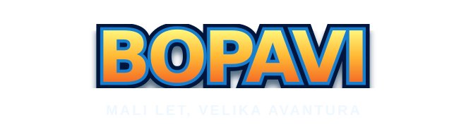
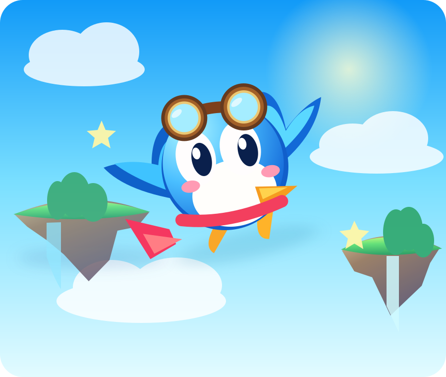
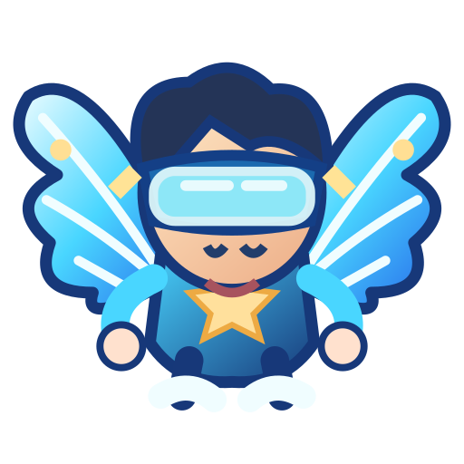
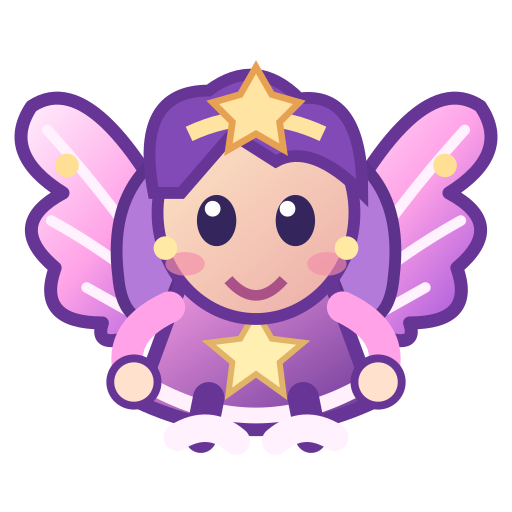
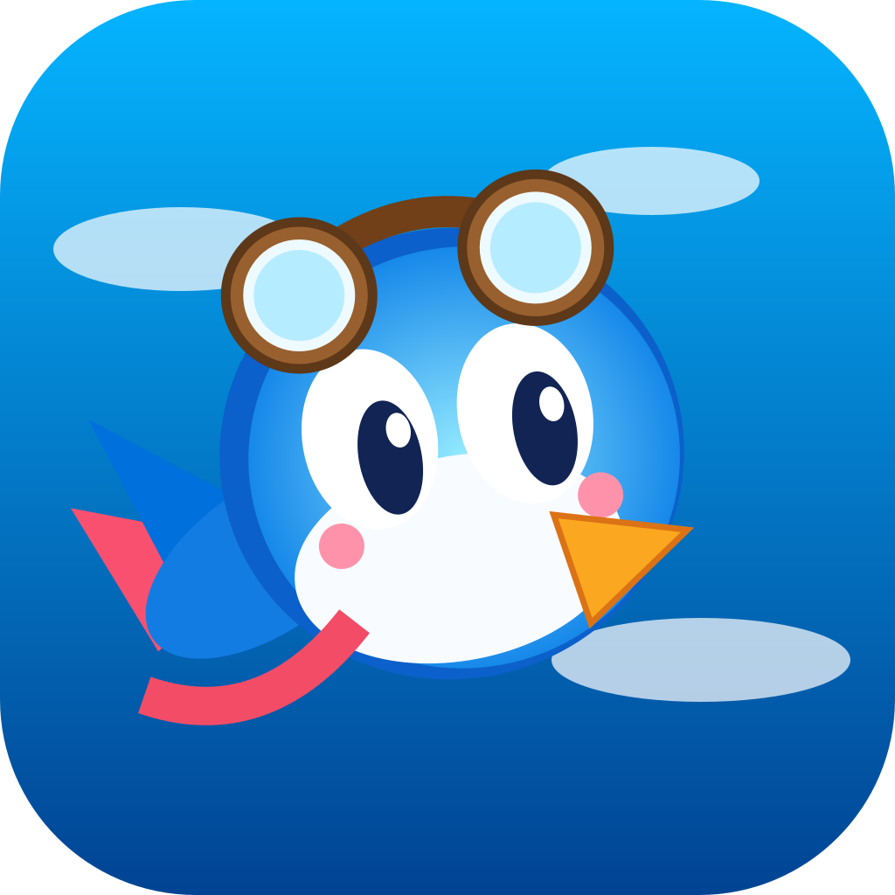

<strong>MALI LET. VELIKA AVANTURA. BEZ KRAJA.</strong>

  
  
  
  

# Poleti u svijet BOPAVI-ja 🪽

**BOPAVI** je arkadna igra letenja za Android i iPhone u kojoj jedan dodir pokreće krila, a svaki prolaz donosi novi izazov. Osmisli put između lebdećih otoka, skupljaj predmete i otkrivaj osam različitih svjetova. Svjetovi su dostupni odmah; leveli u pojedinom svijetu otključavaju se redom, a nakon velikog broja jedinstvenih levela avantura nastavlja beskrajnim remiksima.

Nema internetske prijave, reklama, praćenja ni kupnje stvarnim novcem. Napredak i najbolji rezultati spremaju se lokalno na tvoj uređaj.

## ✨ Odaberi svog letača

**Prije svakog leta** odaberi lik na zasebnom ekranu s pravim ilustriranim karticama svih devet letača. I Bopi i Portantin imaju vlastiti prepoznatljiv izgled; izbor potvrđuješ gumbom **POLETI S...**. Odabrani izgled ostaje spremljen. Postojeće boje kupljene kovanicama ne gube se prilikom ažuriranja.

**Pošteno otključavanje:** ako želiš novog lika koji se otključava virtualnim kovanicama, prije trošenja dobivaš poseban dijalog s točnom cijenom. Možeš odustati bez promjene salda. Već otključani likovi i Portantin mogu se birati bez naknade. **Noa (220)** i **Any (240)** otključavaju se kovanicama osvojenima u igri.

<figure>
  
</figure>

### Upoznaj Portantina

**Portantin** je novi besplatni član ekipe: simpatični krilati čovječuljak koji nosi malog suputnika na leđima. Ima prepoznatljive pilotske naočale, kiruršku maskicu, rukavice i zasebno animirana krila. Ilustracija je izvorni SVG iz projekta, a Android i iOS koriste zasebno generirane spriteove iz **istog umjetničkog izvora**.

| Lik | Prepoznatljiv izgled | Kako otključati |
|---|---|---|
| 🐦 **Bopi** | Klasični plavi pilot | Dostupan odmah |
| ☀️ **Sunny** | Zlatne nijanse | Kovanice iz igre |
| 🍓 **Berry** | Ružičaste nijanse | Kovanice iz igre |
| 🌙 **Luna** | Ljubičaste nijanse | Kovanice iz igre |
| 🌿 **Mint** | Mentol-zelene nijanse | Kovanice iz igre |
| 🌑 **Shadow** | Tamne nijanse | Kovanice iz igre |
| 🪽 **Portantin** | Krilati nosač sa suputnikom i zaštitnom opremom | **Besplatan od početka** |
| ⚡ **Noa** | Nebeski istraživač sa safirnim pilotskim odijelom, vizir-naočalama i električno plavim krilima | **220 kovanica** |
| ✨ **Any** | Zvjezdana čarobnica s ljubičastom kosom, zvjezdanom tijarom, haljinom i ružičastim krilima | **240 kovanica** |

**Noa i Any — dva premium letača, dvije različite avanture.** Noa istražuje granice neba; Any donosi čaroliju zvijezda. Oba lika imaju vlastite siluete tijela i dva odvojena, animirana krila. Kao i svi drugi likovi, igraju po jednakim pravilima: bez prednosti u brzini, fizici ili kolizijama, bez plaćanja stvarnim novcem.

## 🌍 Osam svjetova — jedan neprekinuti let

| Svijet | Što skupljaš | Atmosfera |
|---|---|---|
| 🌿 **Zelene livade** | Zvjezdice | Šume i lebdeći otoci |
| 🏝️ **Sunčana plaža** | Školjke | Pješčane obale i valovi |
| ❄️ **Ledeni vrhovi** | Pahulje | Ledeni vrhovi i snijeg |
| 🌋 **Vulkan** | Iskre | Užarene stijene i lava |
| 🏛️ **Nebeski hram** | Perje | Hramovi nad oblacima |
| 🌙 **Mračna noć** | Mjesečev prah | Noćni krajolici |
| 💎 **Kristalna šuma** | Kristali | Svjetleći kristali |
| 🪐 **Svemirski let** | Zvjezdani prah | Planeti i zvjezdano nebo |

**Ne postoji rez između uzastopnih levela u istom letu.** Sljedeće se prepreke pripremaju unaprijed i prirodno ulaze u kadar uz **isti stvarni razmak prepreka tekuće zone**, čak i kad se težina mijenja; odabrani lik ne vraćaju se na početak, kamera i pozadina nastavljaju se pomicati, a prikaz ukupnih prolaza stalno raste. Nema zaslona učitavanja ni novog početka pri promjeni broja levela.

## 🎮 Kako igrati

1. Na početnom ekranu odaberi **IGRAJ** ili najprije pogledaj **SVJETOVI**.
2. **Izaberi lika** i potvrdi **POLETI S...**; promjena lika ne troši kovanice ako je već dostupan.
3. **Dodirni ekran** da Bopi ili Portantin zamahne krilima. Izbjegavaj prepreke i skupljaj predmete.
4. Pauza i HUD pojavljuju se **tek nakon prvog stvarnog zamaha**. Svaki dovršeni level vodi u sljedeći bez prekida.
5. Napredak, lokalna ljestvica, postignuća i sigurnosna kopija dostupni su kroz **POSTAVKE**.

**Normalni ●**, **izazovni ⚡**, **bonus ✦** i **elitni ♛** leveli različite su vrste postojećeg proceduralnog generatora. Osvojene virtualne kovanice služe samo za otključavanje boja i dodataka poput štita ili magneta.

## 📱 Android i iOS

Projekt održava dvije zasebne aplikacije: Kotlin/Android Canvas i Swift/UIKit/Core Graphics. Fizika, generiranje levela, bodovi, pravila, izbor likova i spremanje napretka međusobno se provjeravaju Kotlin/Swift testovima.

**[Preuzmi najnovije razvojno izdanje](../../releases)** · **[GitHub CI](../../actions/workflows/native-ci.yml)** · **[Detaljni QA i kriteriji objave](QA.md)** · **[Povijest izmjena](CHANGELOG.md)**

GitHub izdanje može sadržavati razvojni APK, nepotpisani Android AAB te iOS simulator/device ZIP. Oni nisu automatski spremni za Google Play ili App Store: za javnu distribuciju potrebno je službeno potpisivanje i dodatno testiranje na fizičkim uređajima.

## 🔐 Privatnost, kvaliteta i optimizacija

- Nema internetske dozvole, računa, oglasa, telemetrije ni kupnji stvarnim novcem.
- Napredak se čuva lokalno. Izvoz i uvoz JSON kopija su dobrovoljni; ulaz je strogo ograničen na **550 kB** prije učitavanja i provjerava format i raspone.
- Slike likova i svjetova generiraju se tijekom builda iz izvornog materijala u repozitoriju. Nema preuzimanja sredstava tijekom igranja.
- Sljedeći proceduralni level izračunava se unaprijed i čuva za nastavak bez vidljivog poskakivanja prepreka.
- Android emulator i iOS simulator provjeravaju pokretanje, a zasebni paritetni i testovi spremanja štite od regresija. Potpuna vizualna podudarnost **1:1 na svim fizičkim uređajima nije još dokazana**.

---

<strong>BOPAVI — Mali let, velika avantura.</strong> Stvorio Brendigo 💙

